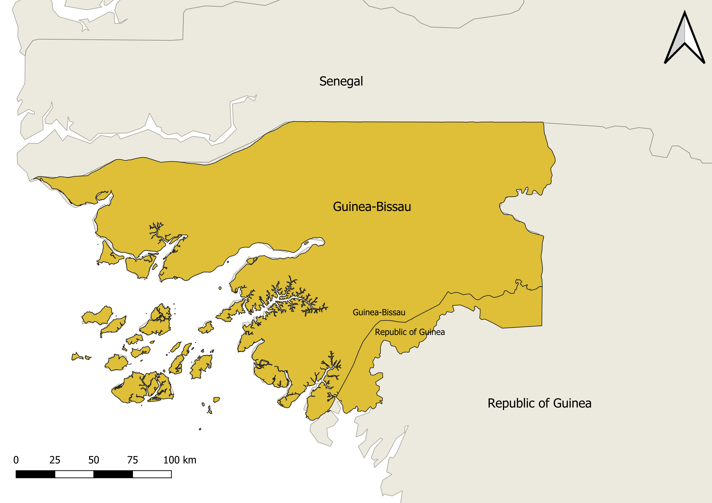

# __ALFICC - Active Learning For Improved landCover Classification__

This repository is intended to share some results and materials from my Master's dissertation project. These deliverables are intended for open access. Everyone is free to use them for research purposes, __as long as this work and the resources' origin are properly cited__.

## __Introduction__

The goal was to use _Sentinel-2 Surface Reflectance_ geospatial data in order to identify cashew orchards with Machine Learning (ML) tools across a region of interest (ROI) comprised of two parts: the country of Guinea-Bissau, and the neighboring region of the Republic of Guinea up to the _Kogon_ river. Active Learning techniques were employed to develop an optimized training dataset from samples scattered across the ROI. This led to the creation of two newly labeled datasets, namely:
* __Random Sampling dataset:__ corresponds to $4498$ samples randomly selected in the ROI.
* __Margin Sampling dataset:__ $1816$ points selected by the margin sampling heuristic. This dataset shows a smaller geographical distribution and sample diversity than the Random Sampling one, but demonstrated its usefulness for ML purposes.

The labels were acquired for the year of 2021. For more details about the project, the data and application, the full dissertation can be found in the [UPorto open repository](https://hdl.handle.net/10216/164196)

## Contents

The contents shared in this repository regard the following:
* The two datasets of labeled samples that were created during the project's execution.
* Cashew land cover maps obtained with ML model predictions.

## Programming requirements

Scripts have been developed using __JavaScript__ (in Google Earth Engine's code editor) and __Python__.

* For the __Python__ scripts, the following packages were used:
  * numpy
  * pandas
  * sklearn
  * geopandas
  * rasterio
  * rioxarray
____

* Author: Miguel Ribeiro Pereira, MSc, Faculty of Sciences, University of Porto
* Supervisors: João Pedro Pedroso, INESC TEC, Faculty of Sciences, University of Porto
* Co-Supervisor: Sofia Cardoso Pereira, PhD, Faculty of Engineering, University of Porto
